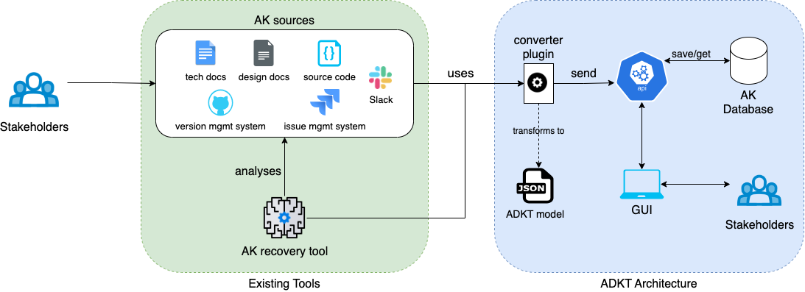

* 
{:toc}

## ADKT architecture

## Existing Tools

### AK sources

There are a large variety of existing tools frequently used in the software development process. Many of these tools can integrate custom plugins to create new add-ons programmatically in order to handle the architecture knowledge related to design decisions.

### AK recovery tools

Also, in the existing tools there are different approaches to analyze existing tools and documents to extract the knowledge about design decision making.

## ADKT Architecture

This is the proposed architecture to handle this kind of data and to query/save it in a proper way.

### Converter plugin

Represents each integration created on the different **AK sources**, this plugins must structure an fulfill the data using the **ADKT model** to be send to the **API**

### GUI (Graphic User Interface)

A Graphic User Interface that works as a client of the **API**. The idea of this component is to allow each stakeholder query and save information about design decisions. 

### API

Is the server where the **Converter plugins** have to send the converted design decisions to be saved. Also, the **GUI** requests the data and makes updates to the traceability between the design decisions.

### AK Database

Is the server where the design decisions data is persisted and consulted.
