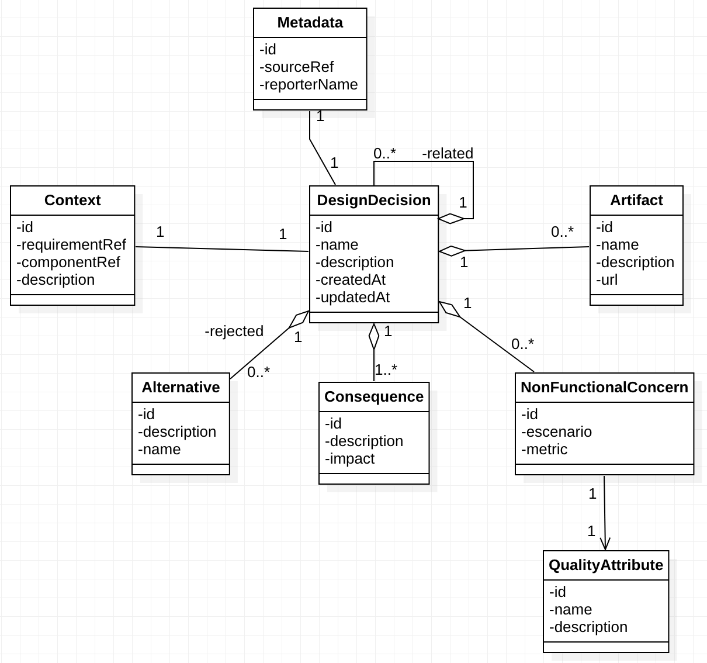

* 
{:toc}

## Data Model



## Schema 

```graphql
enum MetadataSourceRef {
  API
  WEB
}

type Metadata {
  id: ID!
  reporterName: String!
  sourceRef: MetadataSourceRef!
  designDecision: DesignDecision 
}

type Context {
  id: ID!
  requirementRef: String!
  description: String
  componentRef: String!
  designDecision: DesignDecision 
}

type Artifact {
  id: ID!
  name: String!
  description: String
  url: AWSURL!
  designDecisionID: ID! 
  designDecision: DesignDecision 
}

type Alternative {
  id: ID!
  description: String
  name: String!
  designDecisionID: ID! 
  designDecision: DesignDecision 
}

enum ConsequenceImpact {
  Negative
  Positive
  None
}

type Consequence {
  id: ID!
  description: String!
  impact: ConsequenceImpact!
  designDecisionID: ID! 
  designDecision: DesignDecision 
}

type NonFunctionalConcern {
  id: ID!
  scenario: String!
  metric: String!
  qualityAttribute: QualityAttribute! @hasOne
  designDecisionID: ID! 
  designDecision: DesignDecision 
}

type QualityAttribute {
  id: ID!
  name: String
  description: String
  nonFunctionalConcern: NonFunctionalConcern 
}

type DesignDecision {
  id: ID!
  name: String
  description: String
  context: Context 
  metadata: Metadata 
  nonFunctionalConcerns: [NonFunctionalConcern]
  consequences: [Consequence!]!
  alternatives: [Alternative]
  artifacts: [Artifact!]!
  related: [DesignDecision]
  parentDesignDecisionID: ID 
  parentDesignDecision: DesignDecision 
}

# ------------------------- Custom Types for the custom mutations -------------------------
input QualityAttributeInput {
  id: String
  name: String
  description: String
  _deleted: Boolean
}

input NonFunctionalConcernInput {
  id: String
  scenario: String
  metric: String
  nonFunctionalConcernQualityAttributeId: String
  _deleted: Boolean
}

input ConsequenceInput {
  id: String
  description: String
  impact: ConsequenceImpact
  _deleted: Boolean
}

input AlternativeInput {
  id: String
  description: String
  name: String
  _deleted: Boolean
}

input ArtifactInput {
  id: String
  name: String
  description: String
  url: AWSURL
  _deleted: Boolean
}

input ContextInput {
  id: String
  requirementRef: String
  description: String
  componentRef: String
}

input MetadataInput {
  id: String
  reporterName: String
  sourceRef: MetadataSourceRef
}

input RelatedDesignDecisionInput {
    id: String
    name: String
    description: String
    _deleted: Boolean
}

input DesignDecisionInput {
  id: String
  parentDesignDecisionID: String
  name: String
  description: String
  nonFunctionalConcerns: [NonFunctionalConcernInput!]
  consequences: [ConsequenceInput!]
  alternatives: [AlternativeInput!]
  artifacts: [ArtifactInput!]
  context: ContextInput
  metadata: MetadataInput
  related: [RelatedDesignDecisionInput]
}

# //! The parameters for custom mutations must be input type, the response must be a regular type
type Mutation {
  upsertDesignDecision(designDecision: DesignDecisionInput): DesignDecision
}

```

## Elements description

### DesignDecision
It is the central element of the model, it specifies a detailed description of the selected option, as well as its reasons and motivation. In addition, this may have links or be linked to other related design decisions, whether from the past or from the same moment in which it was made. It is important to mention that to carry out traceability and the order of decisions, each record has a creation date, an update date, and an order of precedence. Each of the elements related to and added to the design decisions are mentioned below.

Example:

  - **name**: Authentication/Authorization
  - **description**: Installation of an authentication/authorization server with stronger mechanisms to ensure permitted access to resources.
  - **createdAt**: 05/14/2022 22:00:00
  - **updatedAt**: 05/14/2022 22:00:00
  
### Context
As part of each decision, the context is a fundamental element for its understanding since it provides relevant information about the conditions under which a certain decision is made, in addition, it links a reference to the requirement that motivates making said decision. This reference can be a ticket number, a code for a user story, or any other identifier that contains a more detailed description of the requirement. Finally, a reference is also linked to the component that is positively or negatively affected by the decision, this can be the name of a service, a subsystem, a specific class, a package or any other unit or module.

Example:

 - **requirementRef**: JIRA_ID_XXXX
 - **componentRef**: account_bank_service
 - **description**: Due to unauthorized access to the bank account service, a user's data was modified. This caused great financial damage to the client, consequently, the bank's reputation was affected and its shares depreciated, generating distrust in its investors.

### Alternative
As part of the analysis for the selection of a certain decision, the different options must always be considered when making a tradeoff for each one. Generally, these alternatives are forgotten over time, and above all, why one was not selected over the others is forgotten. This element allows you to record the name of each alternative, as well as the description of why it was not selected.

Example:

 - **name**: Outsourcing
 - **description**: One of the options considered was to outsource the service to the provider XXX, however, this alternative was not chosen due to long-term costs. Furthermore, it was not convenient to have an external dependency on one of the most critical elements of the product.

### Consequence
Every decision brings with it at least one consequence, therefore it is vitally important to fully identify these effects when making said decision. These consequences can have both a negative and positive impact, depending on the perspective from which they are identified.

Example:
 
 - **description**: improved security when authenticating and authorizing resources accessed through the account_bank_service.
 - **impact**: positive
 
### Non Functional Requirements

Generally, decisions related to architectural or design aspects are linked to non-functional aspects. Non-functional concerns go beyond meeting a specific technical requirement; they must specify the quality of how a requirement is met, generally through scenarios that mention: the stimulus and its source, the environment in which it is run. , the affected artifact, the response, and a metric that allows measuring the progress or the missing work to improve.

Example:

 - **scenario**: A user without the correct permissions tries to make requests to the bank account service in the production environment, the new authorization service detects that this user does not have the corresponding permissions blocks the requests coming from the device, and notifies unwanted access to the email related to the account in less than 5 seconds.
 - **metric**: Unlawful access notification time, 5 seconds. Immediate blocking of malicious requests.


### Quality Attribute
It's part of the Non Functional Requirement, and it's related to the quality model implemented for each company. E.g: ISO/IEC 25010.

Example: 

 - **name**: Security.
 - **description**: The following tactics are used to resist attacks: authorization/authentication.

### Artifact
To maintain the traceability of design decisions, not only must the decisions be captured, but they must be linked to other documents, links, or related artifacts. This allows you to go back on decisions and artifacts.

Example:
 
 - **name**: Jira ticket
 - **description**: detailed description of the account_bank_service requirement
 - **url**: https://jira.com/JIRA_TICKET_XXX

### Metadata
This element allows us to know who recorded the design decisions, as well as having control over the sources of knowledge. Depending on the plugin used to register the action, a different reference to the source will be created.

Example:

 - **sourceRef**: Web Application
 - **reporterName**: Santiago Hyun Dorado