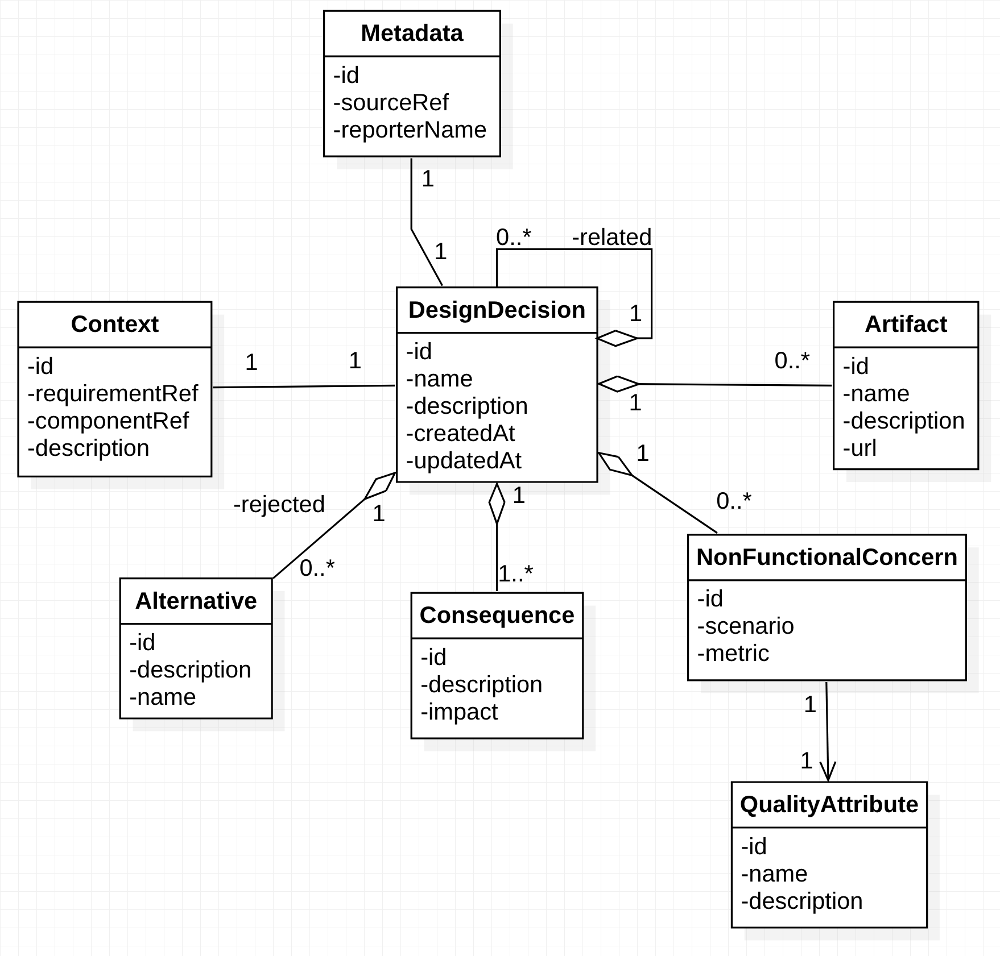

* 
{:toc}

## Data Model



## Schema 

```graphql
enum MetadataSourceRef {
  API
  WEB
}

type Metadata {
  id: ID!
  reporterName: String!
  sourceRef: MetadataSourceRef!
  designDecision: DesignDecision 
}

type Context {
  id: ID!
  requirementRef: String!
  description: String
  componentRef: String!
  designDecision: DesignDecision 
}

type Artifact {
  id: ID!
  name: String!
  description: String
  url: AWSURL!
  designDecisionID: ID! 
  designDecision: DesignDecision 
}

type Alternative {
  id: ID!
  description: String
  name: String!
  designDecisionID: ID! 
  designDecision: DesignDecision 
}

enum ConsequenceImpact {
  Negative
  Positive
  None
}

type Consequence {
  id: ID!
  description: String!
  impact: ConsequenceImpact!
  designDecisionID: ID! 
  designDecision: DesignDecision 
}

type NonFunctionalConcern {
  id: ID!
  scenario: String!
  metric: String!
  qualityAttribute: QualityAttribute! @hasOne
  designDecisionID: ID! 
  designDecision: DesignDecision 
}

type QualityAttribute {
  id: ID!
  name: String
  description: String
  nonFunctionalConcern: NonFunctionalConcern 
}

type DesignDecision {
  id: ID!
  name: String
  description: String
  context: Context 
  metadata: Metadata 
  nonFunctionalConcerns: [NonFunctionalConcern]
  consequences: [Consequence!]!
  alternatives: [Alternative]
  artifacts: [Artifact!]!
  related: [DesignDecision]
  parentDesignDecisionID: ID 
  parentDesignDecision: DesignDecision 
}

# ------------------------- Custom Types for the custom mutations -------------------------
input QualityAttributeInput {
  id: String
  name: String
  description: String
  _deleted: Boolean
}

input NonFunctionalConcernInput {
  id: String
  scenario: String
  metric: String
  nonFunctionalConcernQualityAttributeId: String
  _deleted: Boolean
}

input ConsequenceInput {
  id: String
  description: String
  impact: ConsequenceImpact
  _deleted: Boolean
}

input AlternativeInput {
  id: String
  description: String
  name: String
  _deleted: Boolean
}

input ArtifactInput {
  id: String
  name: String
  description: String
  url: AWSURL
  _deleted: Boolean
}

input ContextInput {
  id: String
  requirementRef: String
  description: String
  componentRef: String
}

input MetadataInput {
  id: String
  reporterName: String
  sourceRef: MetadataSourceRef
}

input RelatedDesignDecisionInput {
    id: String
    name: String
    description: String
    _deleted: Boolean
}

input DesignDecisionInput {
  id: String
  parentDesignDecisionID: String
  name: String
  description: String
  nonFunctionalConcerns: [NonFunctionalConcernInput!]
  consequences: [ConsequenceInput!]
  alternatives: [AlternativeInput!]
  artifacts: [ArtifactInput!]
  context: ContextInput
  metadata: MetadataInput
  related: [RelatedDesignDecisionInput]
}

# //! The parameters for custom mutations must be input type, the response must be a regular type
type Mutation {
  upsertDesignDecision(designDecision: DesignDecisionInput): DesignDecision
}

```