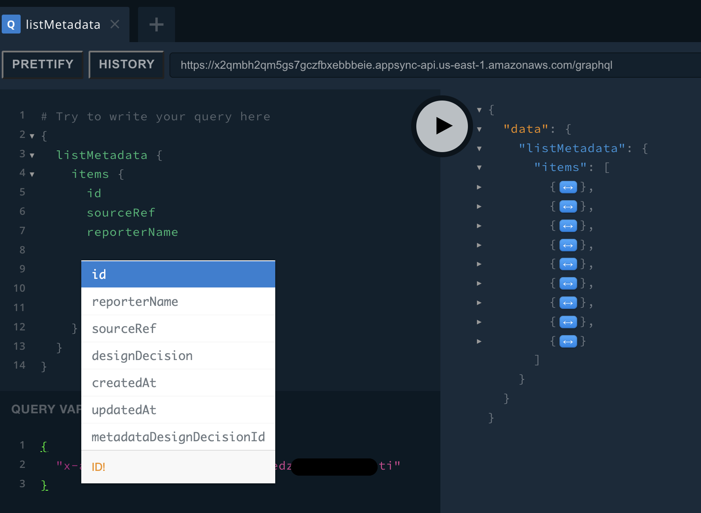

* 
{:toc}

## Postman Collection

Import the next [Postman Collection](assets/ADKT%20Postman%20Collection.postman_collection.json) and test the mutations and queries. Don't forget to change the Authorization variable `x-api-key` with the correct API KEY.

**Query example:**


## GraphQL Playground

GraphQL Playground is a good tool to get suggestions and auto-complete for queries and mutations building.

Install the Browser extension for [GraphQL Playground](https://chrome.google.com/webstore/detail/graphql-playground-for-ch/kjhjcgclphafojaeeickcokfbhlegecd/related):


In the HTTP Header section, setup the API as follow:

```json
{
  "x-api-key": "da2-xxxxxxxxxxxxxxxxxxxxxxxxx"
}
```


Test with mutations and queries:

**URL** 

https://x2qmbh2qm5gs7gczfbxebbbeie.appsync-api.us-east-1.amazonaws.com/graphql



### Queries

Operations to bring the information from all the models in the ADKT model. (Check the [data model](./adkt-models.html))

#### Get

Get an entity info through an id, following the next convention:

**`get[TYPE](id)`**

Example for Consequences: `getConsequence(id)`

#### List

To list, basically it follows the next convention:

**`list[TYPE]s`**

Example for Consequences: `listConsequences`

Additionally, 3 parameter could be included: `filter`, `limit` y `nextToken`.

You can check each parameter in the GraphQL Playground

`listConsequences(filter, limit, nextToken)`

### Mutations

Operations to manipulate (Create, Update, Delete) the information of the elements in the ADKT model.

#### Create

Creates an item in the table `TYPE`

**`create[TYPE](input, condition)`**

Example for Consequences: `createConsequence(input, condition)`

#### Update

Updates an item in the table `TYPE`

**`update[TYPE](input, condition)`**

Example for Consequences: `updateConsequence(input, condition)`

#### Delete

Deletes an item in the table `TYPE`

**`delete[TYPE](input, condition)`**

Example for Consequences: `deleteConsequence(input, condition)`